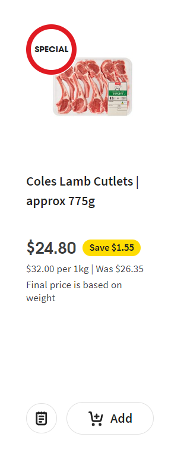

# Selenium Module 
This module is for playing around with selenium and the selenium driver. 


## Real Estate Research
For the [Domain - Melbourne Auctions](https://www.domain.com.au/auction-results/melbourne), we can find that the page is broken up into different div #A, div #B, and so on to div #Y. Within each div #A, it has articles.
```html
div #A - Symbolising the alphabetical section
  article
    header - Suburb name
    div
    div
  article
```
### Execution
To run `realEstate` intelliJ Idea run configuration. 

## Supermarket Selenium Research
Supermarkets typically have a special section. 
### Coles
Link - https://www.coles.com.au/on-special

The Structure of the products are as shown

| Image | Code Breakdown |
|---|----------------|
||                |
```html
<div data-testid="specials-product-tiles" class="..">
    <section data-testid="product-tile" class="jiberish..blah..blah">
        <div class="sc-cb339e35-5 gvhDoj coles-targeting-ProductTileHeaderWrapper">
            <header class="">
                <div class="product_header">
                    <div class="product__image_area" >
                        <a class="product__link product__image" aria-label="" href="/product/coles-lamb-cutlets-approx.-775g-1757810"
                    </div>
                </div>
            </header>
        </div>
    </section>
</div>
```
|
Pschology of priorities(ordered below)
How cheap
Picture of the item
Actual price 

Implement my value costing

#### Feautures
- [ ] Looking at items based on the category e.g. meats, what other meats are on special too? 
- [ ] Filtering of what is the most discounted 
- [ ] Comparing against other supermarkets
- [ ]


## References
[Browser Support](https://www.selenium.dev/documentation/webdriver/browsers/)
[Chrome Specific Options & Capabilities](https://chromedriver.chromium.org/capabilities)